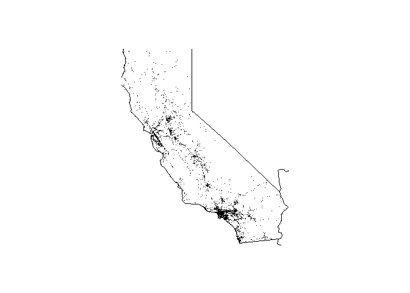

<!-- README.md is generated from README.Rmd. Please edit that file -->
[](https://travis-ci.org/vadimus202/fars)

Intro
-----

Working with FARS data made easy.

Installation
------------

You can install the package from GitHub using the `devtools` package:

``` r
devtools::install_github("vadimus202/fars")
```

Usage Examples
--------------

### Copy FARS files into working directory

``` r
library(fars)
#> Loading required package: maps
library(magrittr)
library(knitr)

my_file <- system.file("extdata", "fars_data.zip", package = "fars")
unzip(my_file, junkpaths = TRUE)
```

### Preview 2015 FARS data

``` r
file_name <- make_filename(2015)
df <- fars_read(file_name)
df %>% head() %>% kable()
```

|  STATE|  ST\_CASE|  VE\_TOTAL|  VE\_FORMS|  PVH\_INVL|  PEDS|  PERNOTMVIT|  PERMVIT|  PERSONS|  COUNTY|  CITY|  DAY|  MONTH|  YEAR|  DAY\_WEEK|  HOUR|  MINUTE|  NHS|  RUR\_URB|  FUNC\_SYS|  RD\_OWNER|  ROUTE| TWAY\_ID | TWAY\_ID2         |  MILEPT|  LATITUDE|   LONGITUD|  SP\_JUR|  HARM\_EV|  MAN\_COLL|  RELJCT1|  RELJCT2|  TYP\_INT|  WRK\_ZONE|  REL\_ROAD|  LGT\_COND|  WEATHER1|  WEATHER2|  WEATHER|  SCH\_BUS| RAIL    |  NOT\_HOUR|  NOT\_MIN|  ARR\_HOUR|  ARR\_MIN|  HOSP\_HR|  HOSP\_MN|  CF1|  CF2|  CF3|  FATALS|  DRUNK\_DR|
|------:|---------:|----------:|----------:|----------:|-----:|-----------:|--------:|--------:|-------:|-----:|----:|------:|-----:|----------:|-----:|-------:|----:|---------:|----------:|----------:|------:|:---------|:------------------|-------:|---------:|----------:|--------:|---------:|----------:|--------:|--------:|---------:|----------:|----------:|----------:|---------:|---------:|--------:|---------:|:--------|----------:|---------:|----------:|---------:|---------:|---------:|----:|----:|----:|-------:|----------:|
|      1|     10001|          1|          1|          0|     0|           0|        1|        1|     127|     0|    1|      1|  2015|          5|     2|      40|    0|         1|          3|          1|      3| SR-5     | NA                |    1754|  33.87865|  -87.32533|        0|        35|          0|        0|        1|         1|          0|          4|          2|         1|         0|        1|         0| 0000000 |         99|        99|          2|        58|        88|        88|    0|    0|    0|       1|          1|
|      1|     10002|          1|          1|          0|     0|           0|        1|        1|      83|     0|    1|      1|  2015|          5|    22|      13|    1|         1|          1|          1|      1| I-65     | NA                |    3604|  34.91044|  -86.90871|        0|        34|          0|        0|        1|         1|          0|          3|          2|        10|         0|       10|         0| 0000000 |         99|        99|         22|        20|        88|        88|    0|    0|    0|       1|          0|
|      1|     10003|          1|          1|          0|     0|           0|        2|        2|      11|     0|    1|      1|  2015|          5|     1|      25|    0|         1|          3|          1|      2| US-SR 6  | NA                |    1958|  32.14201|  -85.75846|        0|        42|          0|        0|        1|         1|          0|          4|          2|         1|         0|        1|         0| 0000000 |         99|        99|          1|        45|        99|        99|    0|    0|    0|       1|          1|
|      1|     10004|          1|          1|          0|     0|           0|        1|        1|      45|     0|    4|      1|  2015|          1|     0|      57|    0|         1|          4|          1|      3| SR-27    | NA                |     566|  31.43981|  -85.51030|        0|        53|          0|        0|        1|         1|          0|          4|          2|        10|         0|       10|         0| 0000000 |         99|        99|          1|        15|        88|        88|    0|    0|    0|       1|          1|
|      1|     10005|          2|          2|          0|     0|           0|        2|        2|      45|  2050|    7|      1|  2015|          4|     7|       9|    0|         2|          3|          1|      2| US-SR 53 | HINTON WATERS AVE |     308|  31.31933|  -85.51510|        0|        12|          6|        0|        2|         3|          0|          1|          1|         1|         0|        1|         0| 0000000 |         99|        99|          7|        16|        88|        88|    0|    0|    0|       1|          0|
|      1|     10006|          1|          1|          0|     0|           0|        2|        2|     111|     0|    8|      1|  2015|          5|     9|      59|    0|         1|          5|          2|      4| CR-82    | NA                |       0|  33.43849|  -85.38927|        0|         1|          0|        0|        1|         1|          0|          4|          1|         1|         0|        1|         0| 0000000 |         99|        99|         10|        17|        99|        99|    0|    0|    0|       1|          0|

### Summarize 2013-2015 data

``` r
fars_summarize_years(2013:2015) %>% kable()
```

|  MONTH|  2013|  2014|  2015|
|------:|-----:|-----:|-----:|
|      1|  2230|  2168|  2368|
|      2|  1952|  1893|  1968|
|      3|  2356|  2245|  2385|
|      4|  2300|  2308|  2430|
|      5|  2532|  2596|  2847|
|      6|  2692|  2583|  2765|
|      7|  2660|  2696|  2998|
|      8|  2899|  2800|  3016|
|      9|  2741|  2618|  2865|
|     10|  2768|  2831|  3019|
|     11|  2615|  2714|  2724|
|     12|  2457|  2604|  2781|

### Plot 2014 accidents on California state map

``` r
fars_map_state(6,2014)
```


